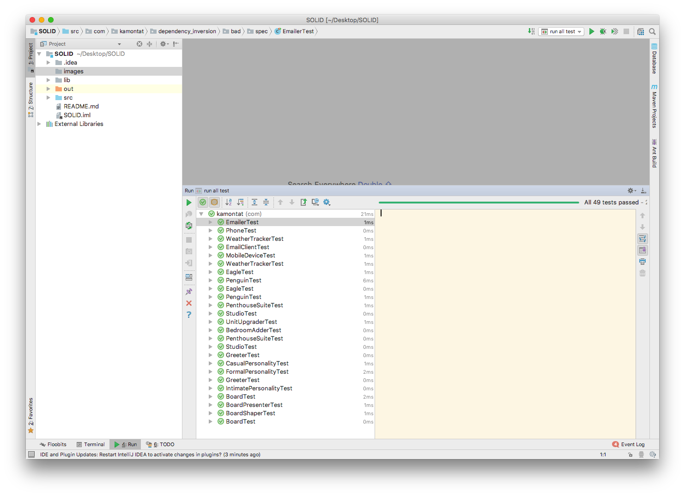

# SOLID Principles  

This project get code from <https://github.com/mikeknep/SOLID>, For **education** only.
I recommend you to read this manual inside [Github](https://github.com/kamontat/SOLID) website for better view.

## Table of contents

- [SOLID Principles !badge-education !badge-education](#solid-principles-badge-education-badge-education)
    - [Table of contents](#table-of-contents)
    - [Description](#description)
        - [Dependency Inversion Principle](#dependency-inversion-principle)
        - [Interface Segregation Principle](#interface-segregation-principle)
        - [Liskov Substitution Principle](#liskov-substitution-principle)
        - [Open Closed Principle](#open-closed-principle)
        - [Single Responsibility Principle](#single-responsibility-principle)
    - [Images](#images)
    - [Creator](#creator)

## Description

### [Dependency Inversion Principle](./src/com/kamontat/dependency_inversion)

> In high-level modules should not depend on low-level modules.

As you see in bad design, Inside [WeatherTracker](./src/com/kamontat/dependency_inversion/bad/src/WeatherTracker.java) class have [Phone](./src/com/kamontat/dependency_inversion/bad/src/Phone.java) and [Emailer](./src/com/kamontat/dependency_inversion/bad/src/Emailer.java) class, which bad design because if I try to create new receiver like `SMS` class, I need to modify code 2 place (in `SMS.java` and `WeatherTracker.java`). To fix this issue, in good code it use [Notifier](./src/com/kamontat/dependency_inversion/good/src/Notifier.java) which contain action method if it receive message. Now instead of have client code ([Phone](./src/com/kamontat/dependency_inversion/bad/src/Phone.java) and [Emailer](./src/com/kamontat/dependency_inversion/bad/src/Emailer.java)) inside server code ([WeatherTracker](./src/com/kamontat/dependency_inversion/bad/src/WeatherTracker.java)), we use [Notifier](./src/com/kamontat/dependency_inversion/good/src/Notifier.java) pass as parameter to notify. So that [Notifier](./src/com/kamontat/dependency_inversion/good/src/Notifier.java) became to `interface` that allow another class to implement it.

### [Interface Segregation Principle](./src/com/kamontat/interface_segregation)

> Clients should not be forced to depend on any interfaces they do not use.

For example of this is [Bird](./src/com/kamontat/interface_segregation/bad/src/Bird.java) class, The bad design will auto appear since no all of bird can fly so like in the bad code design [Eagle](./src/com/kamontat/interface_segregation/bad/src/Eagle.java) and [Penguin](./src/com/kamontat/interface_segregation/bad/src/Penguin.java) that in [Penguin](./src/com/kamontat/interface_segregation/bad/src/Penguin.java) fly method throw [UnsupportedOperationException](https://docs.oracle.com/javase/7/docs/api/java/lang/UnsupportedOperationException.html). In new design ([the good one](./src/com/kamontat/interface_segregation/good/src)) it separate all of action as new interface.

For example:

- [FlyingCreature](./src/com/kamontat/interface_segregation/good/src/FlyingCreature.java)
- [FeatheredCreature](./src/com/kamontat/interface_segregation/good/src/FeatheredCreature.java)
- [SwimmingCreature](./src/com/kamontat/interface_segregation/good/src/SwimmingCreature.java)

### [Liskov Substitution Principle](./src/com/kamontat/liskov_substitution)

> Functions that references to base classes must be able to use objects of derived classes without knowing it.

As you see method `upgrade` in [UnitUpgrader](./src/com/kamontat/liskov_substitution/bad/src/UnitUpgrader.java), there have a code to check class of parameter is it `Studio` or not. That is should not be. To fix this issue, it try to separate class that not have same role so the adapter class (like [BedroomAdder](./src/com/kamontat/liskov_substitution/good/src/BedroomAdder.java)) will don't have to check no matter it is.

### [Open Closed Principle](./src/com/kamontat/open_closed)

> Software program should be open for extension, but closed for modification.

In the [bad](./src/com/kamontat/open_closed/bad/src) example, the issue will appear when developer want to add new way to greet people developer need to modify [Greeter](./src/com/kamontat/open_closed/bad/src/Greeter.java), and later on [Greeter](./src/com/kamontat/open_closed/bad/src/Greeter.java) class will became fatty. So to fix it reference to description of open closed principle, that is extension. [Personality](./src/com/kamontat/open_closed/good/src/Personality.java) is the interface of greeting type, and that each of class refer to each of greeting type. so if need to create new type of greet, it just create new class that implement [Personality](./src/com/kamontat/open_closed/good/src/Personality.java) and pass to constructor method in [Greeter](./src/com/kamontat/open_closed/good/src/Greeter.java) class.

### [Single Responsibility Principle](/src/com/kamontat/single_responsibility)

> Every class should have a single responsibility.
> There should never be more than one reason for a class to change.

For instance [bad](./src/com/kamontat/single_responsibility/bad/src) example, Board class have multiple responsibility such as getting board's rows, print the board to screen. so the **Single Responsibility Principle** tells us that this class is actually handling far too many. Consider the [Board](./src/com/kamontat/single_responsibility/good/src/Board.java) class in good example, this response only the values of its spots. The [BoardShaper](./src/com/kamontat/single_responsibility/good/src/BoardShaper.java) and [BoardPresenter](./src/com/kamontat/single_responsibility/good/src/BoardPresenter.java) class are similarly focused on specific tasks. They also pass only needed attributes; for example, BoardShaper object are initialized with only size since they don't need to know whole board.

## Images

## Creator

Kamontat Chantrachirathumrong 5810546552